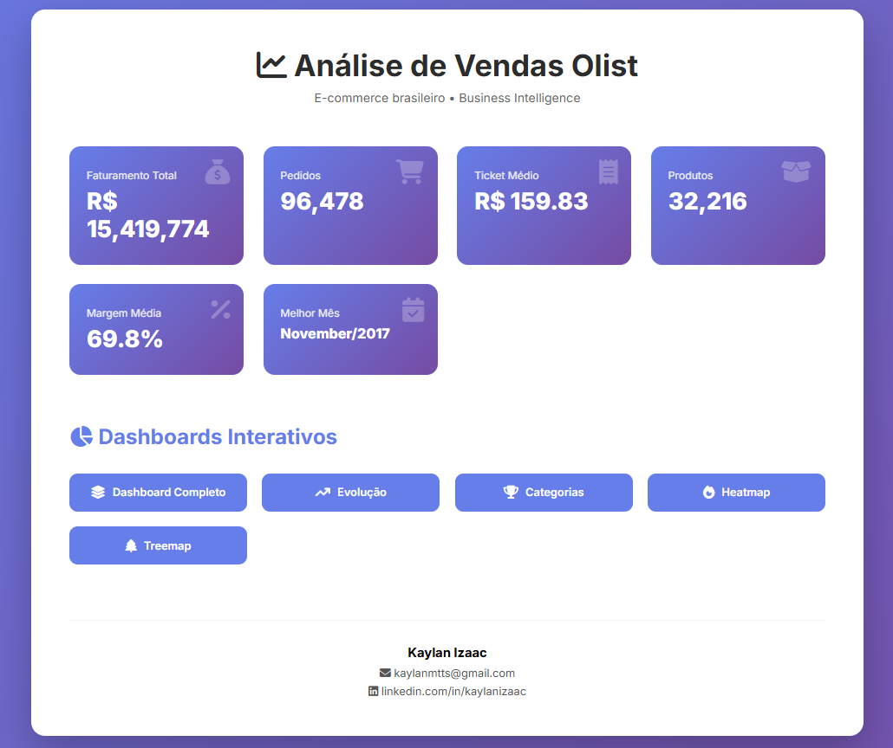

# 📊 Análise de Vendas - E-Commerce Brasileiro (Olist)

🔗 **Acesse o relatório interativo gerado online:**

> https://kaylanms.github.io/analise-vendas-ecommerce/outputs/relatorio_completo.html

---

---

## 📌 Sobre o Projeto

Análise exploratória de dados de vendas do e-commerce brasileiro **Olist**, identificando:

- Padrões de consumo sazonal
- Categorias mais rentáveis
- KPIs estratégicos
- Insights acionáveis para negócio

O projeto gera um **relatório em HTML**, com:

✔ KPIs em cards  
✔ Botões de navegação  
✔ Gráficos interativos

---

## 🎯 Objetivos

- Identificar padrões de sazonalidade
- Analisar produtos e categorias mais rentáveis
- Calcular KPIs financeiros
- Otimizar estoque
- Gerar insights estratégicos
- Criar dashboards interativos

---

## 🛠️ Tecnologias Utilizadas

### Linguagens & Bibliotecas

- Python **3.14.2**
- Pandas
- NumPy
- Matplotlib
- Seaborn
- Jupyter Notebook

### Ferramentas

- Plotly
- Git / GitHub
- GitHub Pages

---

## 📊 Principais Insights

### 💰 KPIs Gerais

- **Faturamento Total:** R$ 15.419.774
- **Ticket Médio:** R$ 159,83
- **Pedidos:** 96.478
- **Margem Média:** 69,8%

### 📈 Sazonalidade

- Pico de vendas em **novembro**
- Crescimento consistente no 2º trimestre
- Segundas-feiras com maior volume

### 🏆 Produtos Rentáveis

- Top 3 categorias = **25,6%** da receita
- Categoria líder: **beleza_saude**
- Maior margem: **relogios_presentes (82%)**

---

Este projeto demonstra a aplicação prática da Análise de Dados para geração de valor em negócios digitais, utilizando técnicas de análise exploratória, visualização de dados, KPIs estratégicos e relatórios interativos.
